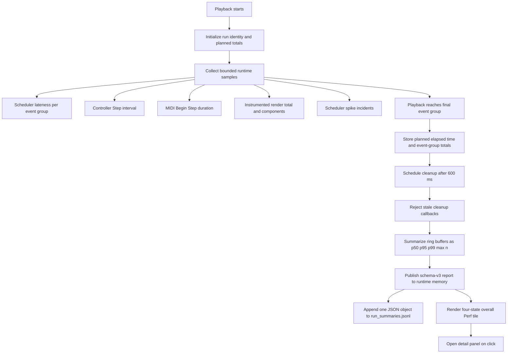

# Post-Play Runtime Performance Reporting

## Purpose and Scope

The post-play runtime performance report describes the health of the game runtime during the most recently completed playback. It is an engineering diagnostic, not a score of the player's musical performance.

The report answers four questions:

1. Did the game controller maintain its intended update cadence?
2. Were scheduled playback event groups dispatched near their target times?
3. How much time did MIDI input processing consume?
4. How much time did the participating instrumented render path consume?

## Implementation Status

The schema-v3 implementation is code-complete. It resets once per accepted playback, collects overall/per-tune/transition scopes in parallel, publishes the completed report to runtime memory at the final event group, persists one JSONL record after stale-callback validation, and drives the compact tile and detail popup from one centralized classification.

Schema v3 adds whole-run dispatch accuracy independent of rolling diagnostic buffers. Every dispatched timestamp group updates fixed signed/absolute 0.5 ms histograms, exact counts within 0.5/1/2/5/10/20 ms, exact whole-run mean/min/max, and a bounded top-12 incident list. Groups inside the startup grace window are retained separately and excluded from steady-state accuracy/status. If scheduler arming creates an initial backlog, startup remains active while those ordered groups are at least 20 ms late, then permanently ends when dispatch catches up; normal count-in timing remains measured. Incidents within 100 ms of a tune-content segment start are categorized as `segment_start`.

Each report context also records `player_input_event_count`, `player_input_observed`, and `workload_profile`. A run with active capture and no player MIDI is labeled `play_only`; it is useful as a light playback baseline but is not representative of full practice/scoring load.

Live GameMaker validation remains required for the matrix at the end of this document, especially short-run `N/A`, immediate replay, set transition attribution, active-segment review navigation, and render-total reconciliation.

Musical accuracy, note matching, timing quality, and embellishment scoring are produced by the scoring and event-history workflows and are outside this report.

## Runtime Workflow



### 1. Configuration

`obj_game_viz` enables lightweight summary sampling by default through `global.RT_BUDGET_DIAG_ENABLED`. Long-form file logging and Output-window logging remain disabled. This keeps the compact post-play report available without enabling the heavier diagnostic channels.

The default scheduler-focused configuration records:

- scheduler lateness;
- controller Step interval;
- MIDI processing duration;
- controller Step duration;
- scheduler callback and MIDI-send duration;
- deferred-work duration;
- total participating render duration.

Long-form anchor/controller-phase logging remains disabled by default. Fixed report-buffer writes for participating visual owners and full controller Step runtime are enabled; they do not format strings, grow arrays, sort, or write files during playback.

### 2. Playback Start

`tune_start()` accepts the grouped plan, resets all legacy/report buffers and prior-step timestamps, records the planned totals and explicit play ID, and creates overall, ordered segment, and transition scopes. A timestamp group contains all playback events due at the same planned time.

### 3. Active Sampling

Most sampling is gated by both an active scheduler and a non-empty active playback event array. Idle menu and review time are therefore excluded.

Scheduler and controller-interval samples also exclude the first 1,000 ms of playback. MIDI and Draw duration samples do not use this warmup.

The buffers are bounded:

| Metric | Capacity | Sampling point | Warmup |
|---|---:|---|---:|
| `scheduler_late_ms` | 128 | Each dispatched timestamp group | 1,000 ms |
| `controller_step_interval_ms` | 256 | Start-to-start interval between controller Steps | 1,000 ms |
| `midi_process_ms` | 256 | Duration of `MIDI_process_messages()` in Begin Step | None |
| `controller_step_ms` | 256 | Full controller Step duration | None |
| `render_total_ms` | 256 | Accumulated participating visual owners, finalized in Draw GUI | None |

Once full, a buffer represents the most recent samples, not the complete run. Percentiles for long runs therefore describe a recent rolling window at the end of playback.

### 4. Completion and Persistence

At the final playback group, the runtime stores:

- final planned timestamp as `elapsed_ms`;
- total timestamp groups;
- total planned events.

The final event group computes and publishes the immutable schema-v3 summary to `global.PERF_REPORT_LATEST`, so the UI cannot briefly show the prior run. Cleanup runs 600 ms later, compares its scheduled play ID with the current play ID, ignores stale callbacks, and appends one JSON object to:

`<user-data-root>/performances/run_summaries.jsonl`

During IDE runs, the current authoritative location is normally:

`%LOCALAPPDATA%/Silly_Wizard/datafiles/performances/run_summaries.jsonl`

Duplicate writes for the same play ID are suppressed.

Only schema-v3 records are accepted. After each append, the ledger is pruned to its newest 200 non-empty records. This bounds the fallback reader's full-file scan without deleting detailed performance exports.

Detailed per-run CSV/JSON exports and debug artifacts are separate from this compact ledger. They are not read during playback and are not automatically deleted because they may contain player history. `EVENT_HISTORY_AUTO_EXPORT` defaults to false; manual export remains available for runs worth retaining. For development cleanup, `cleanup_runtime_history.ps1` reports the selected folders by default, supports `-OlderThanDays`, and deletes files only when passed `-Delete`.

### 5. Post-Play UI

The post-play Game Viz controls display a compact overall tile:

- `Perf: OK` when cadence/scheduler targets are met;
- `Perf: CAUTION` for moderate overage or one isolated incident;
- `Perf: WARN` for hard overage, repeated incidents, or an extreme stall;
- `Perf: N/A` when no summary is available.

The compact second line shows:

- `c95`: controller Step interval p95;
- `s95`: scheduler lateness p95;
- `sp`: scheduler spike incident count.

Clicking the tile opens a detail view in place of the judge panel. It shows centralized reasons, cadence/scheduler p50/p95/p99/max and sample counts, controller/MIDI/render p95, and severe incidents. Set mode defaults to the review-selected tune and provides Tune/Set Overall controls.

Set reports also persist pre-play cache preparation (`set_prepare_total_ms`, score/override preload, nav/model build) and one bounded record per live `segment_switch`. Preparation occurs before playback and is context only. Live cache swaps and deferred title updates remain part of ordinary controller Step/cadence measurements; boundary records add component attribution without subtracting or hiding that work.

Set preparation preloads score sprites and transition override bundles, then builds each segment's trimmed measure-nav and canonical structure model. Live segment changes swap cached references and enqueue the cosmetic title refresh. Missing runtime caches are reported as misses and are not rebuilt synchronously during playback.

## Metric Definitions

Each metric summary has this shape:

```json
{
  "p50": 2.0,
  "p95": 4.0,
  "p99": 6.0,
  "max": 8.0,
  "n": 128
}
```

Percentiles use a sorted nearest-lower-rank sample index. They are not interpolated. Negative values are clamped to zero when the final summary is built.

### Controller Step Interval

`controller_step_interval_ms` measures elapsed wall-clock time from the start of one controller Step to the start of the next. It is a cadence metric, not the CPU duration of the Step code.

At the current 333 FPS setting, the nominal interval is:

$$T_{step} = \frac{1000}{333} \approx 3.00\text{ ms}$$

A high value indicates that the controller was not scheduled at its intended cadence. Causes can include frame contention, OS scheduling, blocking I/O, rendering pressure, driver calls, or other engine work. It does not by itself identify which subsystem caused the delay.

### Scheduler Lateness

`scheduler_late_ms` is calculated for each dispatched timestamp group:

$$L = t_{actual} - (t_{planned} + t_{audio\ offset})$$

The final summary clamps negative samples to zero. The metric therefore reports dispatch tardiness, not signed jitter and not absolute error. A zero can mean on-time or early dispatch.

This is the most direct audio-playback timing metric in the compact report. Sustained p95 elevation means a meaningful share of playback groups were dispatched late.

### Scheduler Spike Incidents

A spike incident is emitted when scheduler lateness is at least 20 ms, after the startup grace period. Incidents are cooldown-limited to one every 400 ms.

`spike_count` is therefore the number of reported incident windows, not the exact number of groups that exceeded 20 ms. It is useful as a coarse interruption indicator but must not be interpreted as a complete event count.

### MIDI Processing Duration

`midi_process_ms` measures CPU time spent in `MIDI_process_messages()` during Begin Step. It covers input polling and processing, not MIDI device or audio output latency.

This metric can reveal an expensive polling/input path. It does not show whether input timestamps are musically correct.

### Instrumented Render Duration

`render_total_ms` accumulates the timed timeline, tune-structure, Game Viz control/structure, and notebeam GUI paths and finalizes the total at the `obj_game_viz` Draw GUI boundary. It is the user-facing render-cost metric. `game_viz_draw_ms` remains a narrowly named legacy diagnostic and is not presented as total rendering.

### Context Fields

| Field | Meaning |
|---|---|
| `ts_local` | Local completion timestamp |
| `play_id` | Run identifier, normally derived from the playback start clock |
| `metric_clock` | Declares that the record combines high-resolution and engine timing sources |
| `mode` | Playback-context mode, such as `tune` or `set` |
| `title` | Playback-context display title |
| `segments` | Number of playback-context segments |
| `bpm`, `swing`, `grace_ms` | Active playback settings |
| `elapsed_ms` | Planned timestamp of the final group, not measured wall-clock run duration |
| `groups_total` | Number of distinct planned dispatch timestamps |
| `events_total` | Number of planned playback events |

## Current Status Classification

`perf_report_classify_scope()` is authoritative for disk and UI. Required sample counts gate `N/A`; preferred p95/p99 overages produce `CAUTION`; hard cadence/scheduler limits, repeated content incidents, repeated segment-boundary incidents, or a 100 ms extreme steady-state stall produce `WARN`. Scheduler classification uses whole-run absolute-error histogram percentiles and exact maximum rather than the final rolling window. One isolated cooldown-approved content or boundary incident normally produces `CAUTION`; startup incidents remain visible but excluded.

## Recommended Targets

These targets apply to matched Windows IDE/runtime tests using the current timesource scheduler and 333 FPS controller setting. Comparisons should use the same tune, BPM, loop/set mode, MIDI devices, score visibility, power plan, and build.

### Data Validity Gate

A run should be classified as `INSUFFICIENT DATA`, not OK, unless:

- `scheduler_late_ms.n >= 32`;
- `controller_step_interval_ms.n >= 64`;
- the run extends beyond the 1,000 ms warmup;
- the run-local buffers were reset at playback start.

MIDI and Draw should each have at least 64 samples before their values are displayed as representative.

### Production Targets

| Metric | Target | Investigate | WARN / fail |
|---|---:|---:|---:|
| Controller interval p50 | $\le 3.5$ ms | $> 3.5$ ms | $> 4.5$ ms sustained |
| Controller interval p95 | $\le 4.5$ ms | $> 4.5$ ms | $\ge 6.0$ ms |
| Controller interval p99 | $\le 6.0$ ms | $> 6.0$ ms | $\ge 10.0$ ms |
| Scheduler lateness p50 | $\le 3.0$ ms | $> 3.0$ ms | $\ge 5.0$ ms |
| Scheduler lateness p95 | $\le 4.0$ ms | $> 4.0$ ms | $\ge 6.0$ ms |
| Scheduler lateness p99 | $\le 8.0$ ms | $> 8.0$ ms | $\ge 15.0$ ms |
| Content or boundary spike incidents | 0 | 1 isolated incident in a category | $\ge 2$ in either category, or any repeatable incident |
| MIDI processing p95 | $\le 0.25$ ms | $> 0.25$ ms | $\ge 0.50$ ms |
| MIDI processing p99 | $\le 0.50$ ms | $> 0.50$ ms | $\ge 1.00$ ms |
| Current Draw metric | Informational only | N/A | N/A |

The controller target is anchored to the 3.00 ms nominal frame interval. The scheduler targets are based on established project baselines, where healthy matched runs generally produced scheduler p95 near 2-4 ms. Maximum values remain diagnostic context rather than a standalone pass/fail criterion because one OS or driver stall can dominate `max`.

For release validation, require three matched complete runs. Use the median p95 across those runs and require no repeatable spike at the same structural transition.

## Example Interpretation

A recent complete `Jig of Slurs` run reported approximately:

- controller interval p95: 7.08 ms;
- scheduler lateness p95: 5.56 ms;
- scheduler spike incidents: 1;
- MIDI processing p95: 0.10 ms.

This should be interpreted as:

- controller cadence is outside target and exceeds the current warning threshold;
- scheduler steady-state p95 is near the warning boundary;
- at least one post-startup lateness window exceeded 20 ms;
- MIDI processing is healthy and is unlikely to explain the cadence warning.

Another adjacent run reported scheduler p95 near 285 ms and controller max near 601 ms. That is a major runtime stall, not ordinary scheduler variance. Investigation should correlate such runs with room transitions, cleanup/export work, driver behavior, and OS scheduling rather than attempting small scheduler arithmetic adjustments first.

## Remaining Improvements

The implementation includes run-local reset, validity classification, four statuses, reasons, p50/sample counts, runtime publication, device/configuration context, and instrumented render total. Remaining follow-up work is JSONL rotation/indexing, optional build/power-plan discovery beyond the current `unavailable` placeholders, and live release-gate validation across matched repeated runs.

## Set Playback Policy

### Reset Once Per Playback, Not Once Per Tune

A set should be treated as one continuous playback run. Reset the performance-reporting state once when `tune_start()` accepts the complete set event plan. Do not reset the authoritative buffers when the active tune changes.

Resetting at every tune boundary would lose three important signals:

- the overall health of the complete set;
- stalls caused by tune transitions, score swaps, or segment-state rebuilds;
- earlier tune results by the time the set reaches its final tune.

Instead, collect two scopes in parallel:

1. **Set overall:** one set of buffers covering the entire active playback.
2. **Per tune:** one set of buffers for each `playback_context.segments[]` entry.

Both scopes begin from empty state at set-play start. Samples are appended to the overall buffers and, when they belong to tune content, to the corresponding segment buffers.

### Segment and Transition Attribution

Each set segment already supplies `start_ms`, `content_end_ms`, and `end_ms`. Use these windows as the reporting authority:

- `[start_ms, content_end_ms)` belongs to the tune;
- `[content_end_ms, next_segment.start_ms)` is transition or boundary time;
- time outside a valid tune-content window contributes to set overall and a separate transition bucket, but not to either adjacent tune's content metrics.

Scheduler samples should use the scheduled group time to select the segment. Controller cadence, controller duration, MIDI, and render samples should use the current playback time. This avoids depending on whether the UI has completed its active-segment update during the same frame.

The transition bucket is useful in beta diagnostics because set-specific stalls often occur during score-media restoration, measure-nav rebuilding, or title/context changes. It does not need to be shown in the minimal user report.

### Post-Play Selection Behavior

In set review, the detailed performance window should follow `playback_context.active_segment`, matching score and tune-structure review behavior. When the user selects or seeks into another tune, reopening or refreshing the performance window should show that tune's runtime metrics.

The detail window should also provide a small scope control:

- **Tune:** selected by default in set mode; follows the currently selected tune;
- **Set Overall:** shows the full continuous run, including transitions.

Single-tune playback has only one scope and should not show the scope control.

The always-visible compact report should remain stable and show the overall playback status. In set mode, that means set-overall status rather than changing as the review playhead moves between tunes.

## Implementation Plan

### Desired User Experience

The post-play controls always show one compact two-line report:

- status: `OK`, `CAUTION`, `WARN`, or `N/A`;
- concise evidence: cadence p95, scheduler p95, and severe incident count.

The compact report should not expose subsystem names beyond these familiar timing concepts. Clicking it opens the existing performance detail window.

The detail window provides:

- current scope and title;
- status reasons;
- cadence and scheduler percentiles;
- MIDI, controller-duration, scheduler-callback, and rendering costs;
- sample counts and validity state;
- beta-only component breakdown when beta diagnostics are enabled.

### Phase 1: Correct Run Ownership

1. Call `tune_rt_budget_diag_reset_for_new_run()` in `tune_start()` after non-empty event groups are accepted and before scheduler activation.
2. Reset all ring heads, counts, spike state, previous-step timestamps, and cached summary state for the new play ID.
3. Publish the play ID explicitly at start rather than relying on optional fallback behavior.
4. Add a regression check proving that a short second run cannot inherit `n`, percentiles, or max values from a preceding long run.

Acceptance criteria:

- the first run after process start and every subsequent run begin with zero valid samples;
- summary `n` never exceeds the samples collected during that playback;
- stale cleanup cannot write a summary for a newer run.

### Phase 2: Introduce Report State and Per-Segment Buffers

Create one authoritative runtime struct, owned by `scr_tune_scripts`, containing:

```gml
{
    play_id: -1,
    mode: "tune",
    overall: {},
    segments: [],
    transition: {},
    completed_summary: undefined
}
```

At playback start:

- allocate one overall metric-buffer set;
- allocate one segment metric-buffer set per playback-context segment;
- copy immutable segment identity and timing fields needed for attribution;
- allocate a transition metric-buffer set only in set mode.

Use plain arrays and structs only. Keep the existing fixed-capacity ring-buffer approach.

Acceptance criteria:

- single-tune output remains equivalent to the overall scope;
- a set summary contains one segment summary per playback segment in original order;
- transition samples never contaminate adjacent tune-content summaries.

### Phase 3: Add Low-Cost Component Timing

Keep always-on sampling limited to timer reads and fixed-buffer writes. Do not format strings, create per-frame structs, sort, or write files during playback.

Always-on metrics:

| Metric | Purpose |
|---|---|
| Controller start-to-start cadence | End-to-end update regularity |
| Controller Step duration | Controller-owned CPU work |
| Scheduler lateness | Playback timing consequence |
| Scheduler callback duration | Event-group dispatch cost |
| MIDI processing duration | Input polling and handling cost |
| MIDI send duration | Output-driver send cost |
| Total instrumented render duration | Rendering contribution |
| Deferred-work duration | UI/current-note work moved out of callback |

Implementation rules:

- reuse the existing timer boundaries where they already exist;
- add only missing fixed-ring writes to the hot path;
- calculate percentiles and status after playback;
- keep per-anchor visual timing disabled unless beta diagnostics are enabled.

Acceptance criteria:

- no during-play performance-report file writes;
- no per-sample array growth or struct allocation;
- matched A/B runs show no material regression in controller or scheduler p95 from instrumentation alone.

### Phase 4: Establish Rendering Coverage

Replace the misleading current `draw_ms` presentation with two levels:

1. **User metric:** total instrumented rendering cost for the playback frame.
2. **Beta breakdown:** notebeam, timeline base, timeline overlay/score lane, tune structure, Game Viz controls, and unattributed render time.

If GameMaker event ordering prevents a reliable whole-frame timer around all Draw owners, introduce a lightweight frame accumulator:

- reset the accumulator once at the beginning of the render cycle;
- each participating Draw owner adds its measured duration;
- finalize the previous frame's accumulated total at the next render-cycle boundary;
- record component values only when beta diagnostics are enabled.

Store report context flags with each completed scope, including score drawing on/off and visible visual layers. This allows beta comparisons without exposing component detail in the compact user report.

Acceptance criteria:

- the user-facing render metric includes notebeam, timeline, tune structure, and Game Viz rendering that is active in the tested layout;
- disabling score drawing is recorded in report context;
- component totals approximately reconcile with the reported render total.

### Phase 5: Centralize Status Classification

Add one pure classification function that accepts a completed scope summary and returns:

```gml
{
    status: "ok", // "n/a" | "ok" | "caution" | "warn"
    reasons: [],
    primary_metric: "",
    primary_value: 0
}
```

Classification policy:

- `N/A`: required sample counts are insufficient;
- `OK`: cadence and scheduler metrics meet target and no severe incident occurred;
- `CAUTION`: moderate p95/p99 overage or one isolated spike without sustained percentile degradation;
- `WARN`: hard p95/p99 limit exceeded, multiple spike incidents, or one extreme stall.

Spikes should complement percentiles rather than duplicate them. A single 20 ms incident should normally be CAUTION. Repeated incidents or an extreme stall should be WARN even when rolling percentiles dilute them.

Persist the classification and reasons in the completed JSON record. The UI must render this result rather than independently reimplementing thresholds.

Acceptance criteria:

- disk record, compact report, and detail window always agree on status;
- missing samples cannot produce OK;
- a single isolated spike does not automatically produce WARN;
- repeated or extreme stalls cannot disappear behind a healthy average.

### Phase 6: Expand the Completed Summary Schema

Write one JSONL record per playback with this high-level shape:

```json
{
  "schema_version": 3,
  "play_id": 12345,
  "mode": "set",
  "title": "Competition MSR",
  "status": { "status": "caution", "reasons": [] },
  "context": {},
  "overall": {},
  "segments": [],
  "transition": {}
}
```

Each segment record should include:

- segment index, tune index, title, and filename;
- start, content-end, and end timestamps;
- metric summaries and sample counts;
- segment-specific classification and reasons.

Context should include scheduler mode, configured FPS, audio backend, score visibility, visible runtime layers, MIDI devices, build identifier, and power-plan label when available.

The runtime report writer and post-play UI accept schema version 3 only. This reporting schema is independent from the Excel/VBA tune JSON schema.

### Phase 7: Minimal Compact Report

Keep the existing compact tile footprint and interaction.

Recommended content:

```text
Perf: CAUTION
c95 4.9  s95 4.6  incidents 1
```

Rules:

- show overall playback status;
- use set-overall status for set playback;
- use `N/A` when sample validity fails;
- color only by centralized classification;
- avoid component-level explanations in the compact tile.

The tile should read the completed summary from runtime memory immediately. Disk is persistence, not the UI synchronization mechanism. This removes the current cleanup/cache delay and prevents the previous run from appearing briefly.

### Phase 8: Existing Detail Window

Reuse the current performance popup and judge-panel replacement behavior.

Header:

- status and selected scope;
- set title or tune title;
- scope control in set mode: `Tune` / `Set Overall`.

User-facing rows:

- status reasons;
- cadence p50/p95/p99/max and sample count;
- scheduler lateness p50/p95/p99/max and sample count;
- controller Step duration p95;
- MIDI processing p95;
- rendering p95;
- severe incident count.

Beta-only expandable rows:

- scheduler callback and MIDI send cost;
- deferred-work cost;
- visual component breakdown;
- context flags and configuration identifiers;
- transition-bucket metrics for sets.

In set mode, `Tune` scope resolves from `playback_context.active_segment` every time the panel is drawn or refreshed. Existing score/tune-structure review navigation therefore changes the displayed tune without creating a second selection model.

Acceptance criteria:

- selecting a different tune in set review changes the Tune-scope report to the same active segment used by score review;
- Set Overall remains available without moving the review playhead;
- opening and closing the performance window does not alter score selection;
- the compact report remains unchanged while navigating tunes.

### Phase 9: Validation Matrix

Functional cases:

1. Single tune longer than warmup.
2. Single tune shorter than warmup, producing `N/A`.
3. Two-tune direct set.
4. Set with a gap or boundary lead-in.
5. Set review navigation between first, middle, and final tunes.
6. Score drawing on versus off.
7. Loop playback, including repeated iterations.
8. Immediate replay before the prior cleanup callback fires.

Performance checks:

- compare instrumentation disabled versus always-on summary instrumentation;
- require no material p95 regression across three matched runs;
- verify per-segment sample totals are plausible for segment duration;
- inject or reproduce a known stall and verify overall, segment/transition attribution, classification, persistence, compact UI, and detail UI agree.

### Recommended Delivery Order

Implement as four reviewable changes:

1. **Correctness foundation:** Phase 1 and Phase 2.
2. **Measurement coverage:** Phase 3 and Phase 4.
3. **Classification and schema:** Phase 5 and Phase 6.
4. **User experience and validation:** Phase 7 through Phase 9.

Do not tune thresholds against new reports until the run-reset and attribution work is complete. Otherwise retained samples and incomplete render coverage can make before/after comparisons misleading.